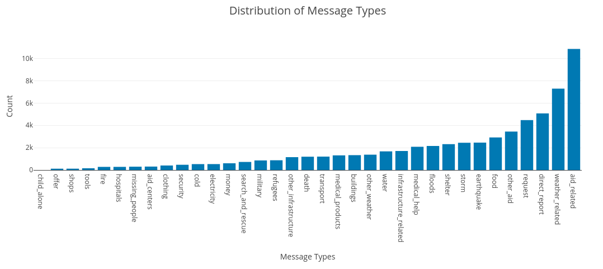
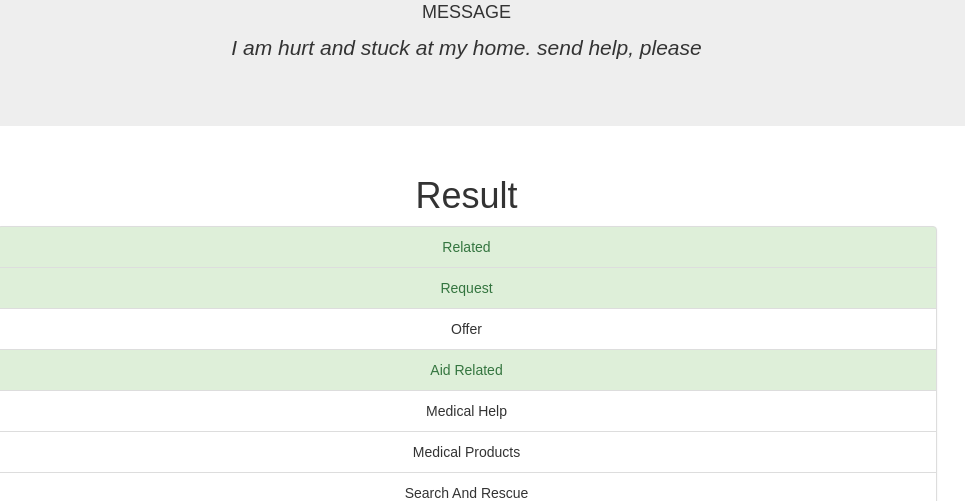

# Disaster Response Pipeline Project

The Disaster Response Pipeline project creates a web app to leverage an ML model that analyzes messages sent during a natural disaster,
and classifies them according to the type of need/aid being requested. 
The Webapp provides statistics on the types of messages used to train the model, and allows users to 
evaluate new messages and how they would be classified by the model.

### Table of Contents

1. [Installation](#installation)
2. [Project Motivation](#motivation)
3. [File Descriptions](#files)
4. [Results](#results)
5. [Licensing, Authors, and Acknowledgements](#licensing)

## Installation <a name="installation"></a>

The project should run on deployments of Python versions 3.*. 
An _environment.yml_ is provided in case of deploying on a new environment, 

For instance, the _environment.yml_ file  can be used to create a conda environment with required packages via:

`conda create -n myenv --file environment.yml`

#### Creating Database from Scratch (optional)
- To run ETL pipeline that cleans data and stores in database:

    `python data/process_data.py data/disaster_messages.csv data/disaster_categories.csv data/DisasterResponse.db`
#### Training and Generating Model
- To train and export model:

    `python models/train_classifier.py data/DisasterResponse.db models/classifier.pkl`


#### Starting the Web Application
- To execute the web application just run the following command in the app's directory:

    `python run.py`

- Go to the provided address for the website. Ex: http://0.0.0.0:3001/

## Project Motivation<a name="motivation"></a>

This project was created as part of the assignments of Udacity's Data Science Nanodegree. 
The Disaster Response Pipeline project involves analyzing data from messages sent during a natural disaster via social media, news and other means. 

The goal of this project is to build a Machine Learning pipeline capable
of ingesting and cleaning the original data and building a NLP model capable of categorizing future messages
in terms of what type of need they might relate to, providing support to the different teams involved in disaster relief by providing a way to quickly classify messages being sent in real time.

## Web Application Usage

The home page of the web application will show overall statistics of the messages used to train the model, like the one presented below:


A message dialog is also provided in order to classify new messages. Once submitted, the resulting categories matched for the message will show in a screen like the one below:


## File Descriptions <a name="files"></a>
The following structure of files is present on this repo:
```
├── app                             
│    ├── run.py                     # Web app startup script
│    └── templates
│        ├── go.html
│        └── master.html
├── data                            
│    ├── disaster_categories.csv    # Original categories used for model training
│    ├── disaster_messages.csv      # Original messages used for model training
│    ├── DisasterResponse.db        # Database of messages
│    └── process_data.py            # Code to load, clean data and export it to database
├── environment.yml
├── LICENSE
├── models
│    ├── classifier.pkl             # Pretrained model
│    └── train_classifier.py        # Code to train and save model
└── README.md                       # This README
```


## Licensing, Authors, Acknowledgements<a name="licensing"></a>

The data used for the analysis is provided by [Figure Eight](https://www.figure-eight.com/).
This work is part of an assignment for the Data Science Nanodegree offered by [Udacity](https://udacity.com). 

The code for this project is available at [Github](https://github.com/adaltof/datascience_u).

<br>This project is distributed under MIT License.

